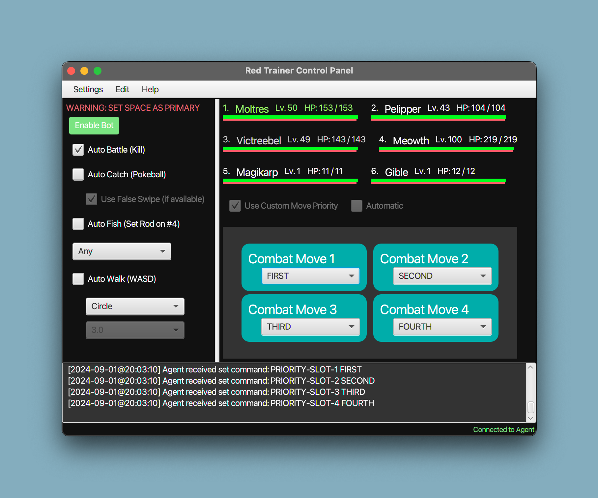
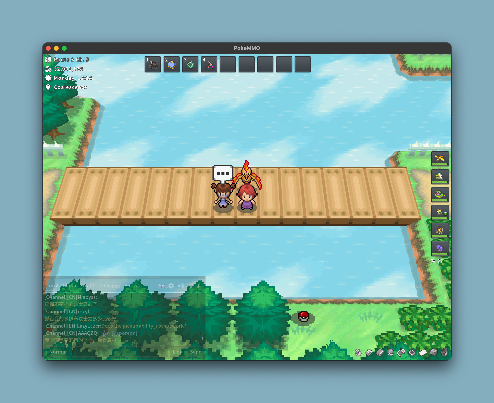
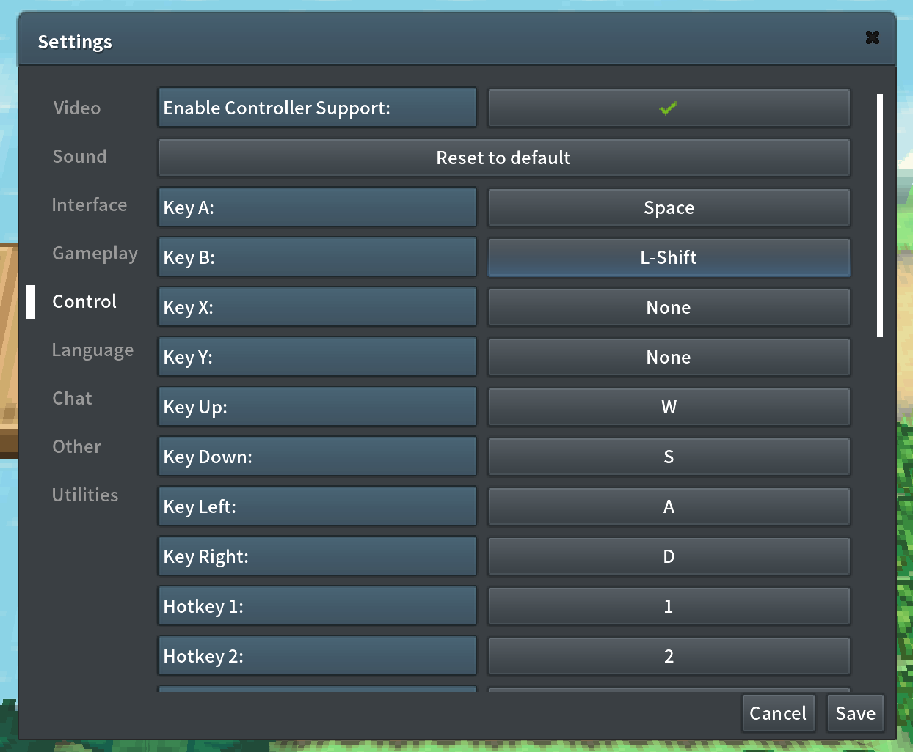

# Red Trainer by vnnsnnt
## A PokeMMO Bot Client

    
    

## Features
1. **Runs while the game window is unfocused.**
2. **Auto Walk** (movement timing may be bugged sometimes, so use it in enclosed spaces)
3. **Auto Fish** (keybind 4, false swipe is necessary right now)
4. **Auto Catch** (use false swipe for best results)
5. **Auto Battle** (payday, level up, with **Custom Move Order**)

## How to Use

### Requirements
- **Java 17 Runtime**
- [Download Java 17](https://www.oracle.com/java/technologies/javase/jdk17-archive-downloads.html)

### Windows
1. Download the `windows_build` from the release.
2. Copy and paste all files from the build into `C:\Program Files\PokeMMO`.
3. Start the game with `windows_start.cmd`.
4. Start the client by running `client.jar`.

### MacOS
1. Download the `macos_build` from the release.
2. Copy and paste all files from the build into `/Users/(your-user-folder)/Library/Application Support/com.pokeemu.macos/pokemmo-client-live`.
3. Start the game by running `./macos_start.sh`.
4. Start the client by running `client.jar`.

### Warning
1. Movement key binds must be set to **WASD**.
2. Primary Key (A) should be set to Space
3. Fishing Rod must be set to **4** to use Auto Fish.

    

